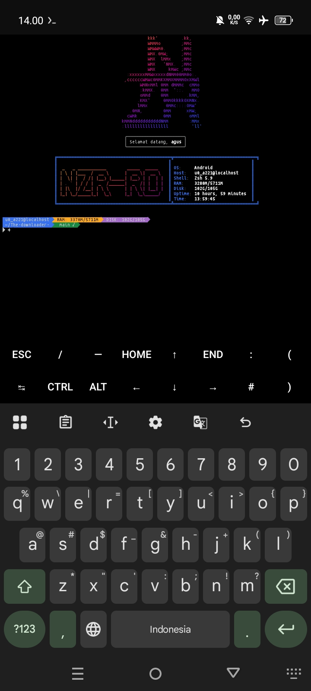

# 🚀 terminal-nzr-theme

Tema terminal Zsh yang dirancang untuk kecepatan, keindahan, dan kemudahan kustomisasi. Cocok digunakan di **Termux (Android)** maupun berbagai distro **Linux**.

---

## 📸 Preview


---

## ✨ Fitur Unggulan
- **Powerline Support:** Tampilan baris perintah yang modern dengan simbol informatif.
- **Universal Installer:** Deteksi otomatis OS (Termux, Debian, Arch, macOS) dan package manager.
- **Interactive Setup:** Personalisasi nama user dan pesan selamat datang saat instalasi.
- **Modular Config:** Pengaturan warna dan fitur cukup melalui file `config.sh`.
- **Auto-Suggestions:** Prediksi perintah berdasarkan riwayat pengetikan.
- **Syntax Highlighting:** Pewarnaan perintah untuk meminimalisir kesalahan ketik.
- **Fancy Headline:** Integrasi Figlet dan Lolcat untuk tampilan ASCII art yang berwarna.

---

## 📥 Cara Instalasi

Pastikan kamu sudah menginstall `git` sebelum memulai. Jalankan perintah berikut langkah demi langkah:

# 1. Clone Repository
```bash
git clone https://github.com/nanang55550-star/terminal-nzr-theme.git
```

# 2. Masuk ke Direktori
```bash
cd terminal-nzr-theme
```

# 3. Berikan Izin Eksekusi
```bash
chmod +x install.sh
```
# 4. Jalankan Installer
```bash
bash install.sh
```
💡 Note for Linux Users:
Jika kamu menggunakan Ubuntu/Debian/Arch, jalankan installer dengan akses root:
```bash
sudo ./install.sh
```


# 5. Muat Ulang Terminal
```bash
exec zsh
```

## ⚙️ Kustomisasi
Kamu bisa mengubah tampilan (Headline text, warna, atau mematikan fitur tertentu) kapan saja dengan mengedit file konfigurasi:
```bash
nano config.sh
```

## 📄 Lisensi
Proyek ini dilindungi di bawah MIT License. Bebas digunakan dan dikembangkan kembali.
